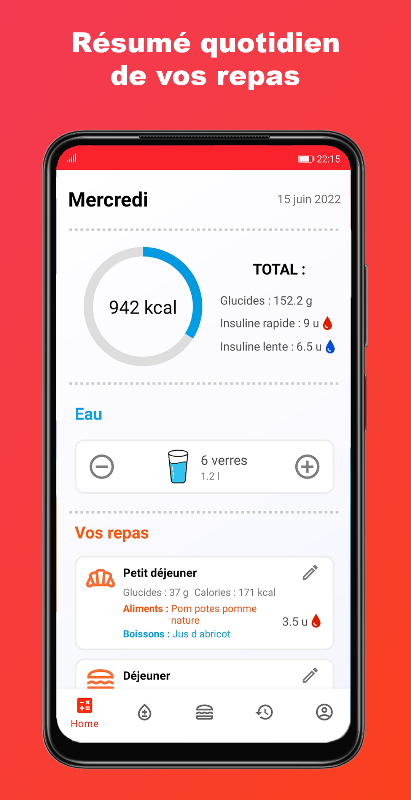
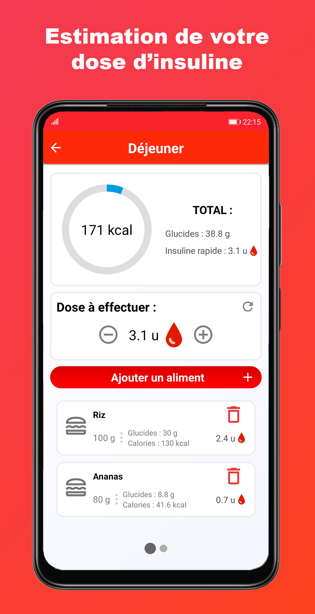
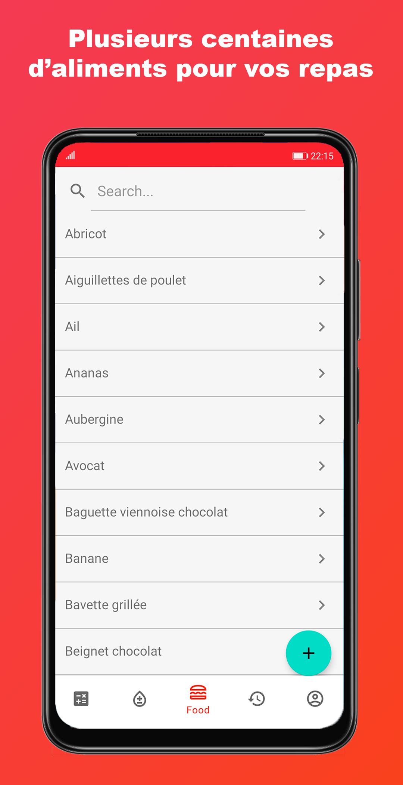
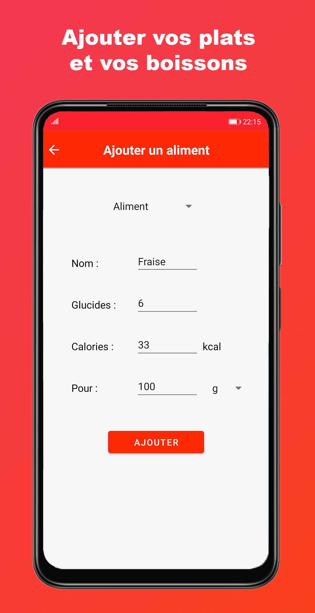
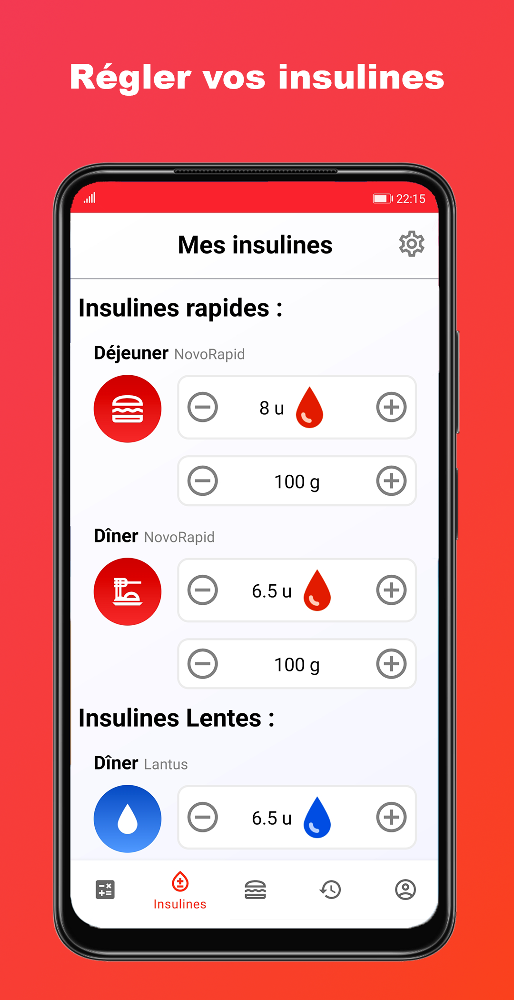
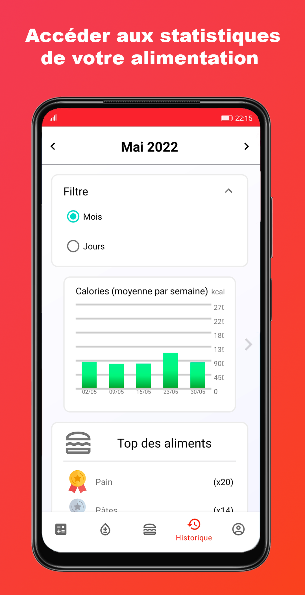
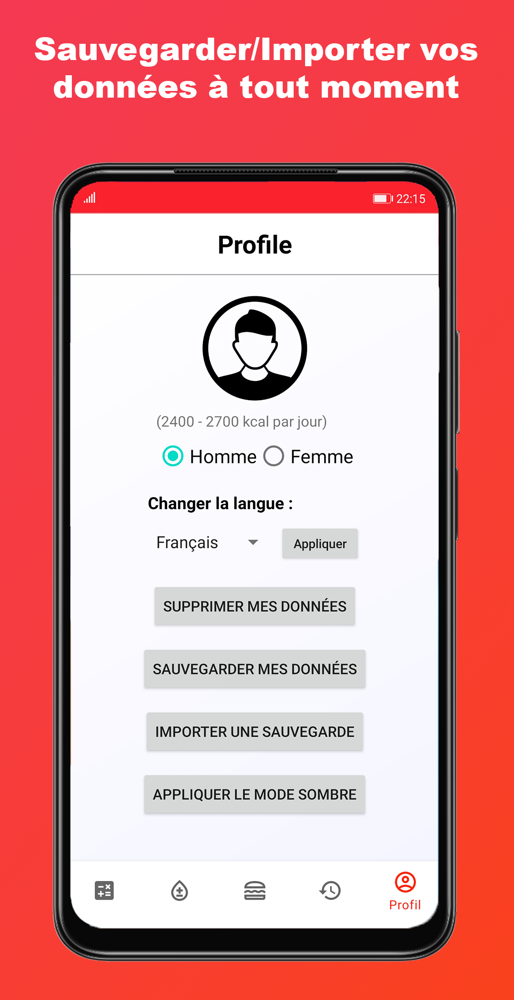
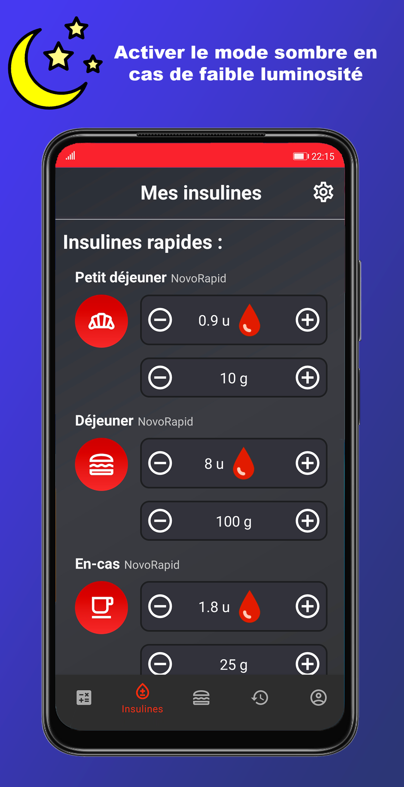

# myDiabLife
A mobile app to simplify diabetes management: automatic carb/calorie tracking and personalized insulin dose estimation.

## Instagram account
[mydiablifefr](https://www.instagram.com/mydiablifefr)

## Download on the Play Store
https://play.google.com/store/apps/details?id=com.care.mydiablife

## Description
Are you tired of calculating? Want to be able to easily manage your meals? Then myDiabLife meets your needs and will greatly facilitate your life! No more calculating the number of carbohydrates and calories on your plate, we do it for you! An estimate of your insulin dose is also given for each of your meals.

Here is a summary of the features in this app:

You will be able to count the number of carbohydrates and calories you eat at each meal very easily. Indeed, a list with many foods is available and you can also add your own foods if necessary (a “quick add” menu is also available in each meal tab. Just slide from right to left). In addition, an estimate of the insulin dose to be taken will be given (if you have noted the insulin dose corresponding to this meal in the parameters).

If you have insulin doses, the app remembers them for you. All you have to do is write down the number of rapid-acting insulin units for a certain number of carbohydrates for each time of the day (it's up to you to specify, for 10g for example). You can also write down your slow insulin if you have one or your basal if you have the pump. Your insulin doses are essential if you want to benefit from an estimate of your insulin dose at each meal.

You can review your last days by sliding from left to right on the HOME menu.

A SETTINGS menu is available on the HOME menu if you swipe from right to left. It allows to change the period and to display for example the last 30 days.

You can see many statistics about your meals. Such as the average carbohydrates (calories, etc…) or for example the top foods (or drinks) that you eat the most over a given period.

On the profile, you can specify whether you are a man or a woman. This allows you to know the number of calories you are advised to eat in a day (for example 1800 to 2200 kcal per day for a woman). The graphs present on the HOME menu and in the tab of each meal can thus be colored in green, yellow or red depending on the number of calories you have eaten.

From the profile tab, you can also change the language and put the application in English. However, be aware that all food and beverages entered into the app are only available in French at this time.

Finally, from this same page, you can: delete, save or import your data. When you click on save, a JSON file containing all your data is saved in the DOWNLOAD folder of your device. If you break your phone, all you have to do is re-import this file to your new device to recover all your data. You can also delete all your data and return to the app's welcome page.

A dark mode is also available. You can activate it from the profile page. It is advisable to use it when it is dark to avoid visual fatigue.

Download now and take back control of your meals!

## Description FR
Vous êtes fatigué de calculer ? Vous voulez pouvoir gérer facilement vos repas ? Alors myDiabLife répond à vos besoins et va grandement vous faciliter la vie
! Fini de calculer le nombre de glucides et de calories dans votre assiette, on le fait pour vous
! Une estimation de votre dose d’insuline est également donnée pour chacun de vos repas.

Voici un résumé des fonctionnalités dans cette application :

Vous allez pouvoir compter le nombre de glucides et de calories que vous mangez à chaque repas très facilement. En effet, une liste avec de nombreux aliments est disponible et vous pourrez ajouter également vos propres aliments si besoin (un menu “ajout rapide” est également disponible dans chaque onglet repas. Il suffit de slider de droite à gauche).. De plus, une estimation de la dose d’insuline à effectuer sera donnée (si vous avez noté la dose d’insuline correspondant à ce repas dans les paramètres).

Si vous avez des doses d'insuline, l’application les retient pour vous. Il vous suffit de noter pour chaque moment de la journée le nombre d'unités d’insuline rapide pour un certain nombre de glucides (à vous de le préciser, pour 10g par exemple). Vous pouvez également noter votre insuline lente si vous en avez une ou votre basale si vous avez la pompe. Vos doses d’insuline sont indispensables si vous voulez profiter d’une estimation de votre dose d’insuline à chaque repas.

Vous pouvez revoir vos dernières journées en slidant de gauche à droite sur le menu HOME.

Un menu SETTINGS est disponible sur le menu HOME si vous slidez de droite à gauche. Il permet de changer la période et d’afficher par exemple les 30 derniers jours.

Vous pouvez voir de nombreuses statistiques sur vos repas. Tels que la moyenne des glucides (calories, etc…) ou par exemple le top des aliments (ou des boissons) que vous mangez le plus sur une période donnée.

Sur le profil, vous pouvez préciser si vous êtes un homme ou une femme. Cela permet de savoir le nombre de calories qu’il vous est conseillé de manger sur une journée (par exemple 1800 à 2200 kcal par jour pour une femme). Les graphiques présents sur le menu HOME et dans l’onglet de chaque repas pourront ainsi se colorier en vert, jaune ou rouge selon le nombre de calories que vous avez mangé.
Depuis l’onglet profil, vous pouvez également changer la langue et mettre l’application en anglais. Cependant, sachez que tous les aliments et boissons saisis dans l’application sont disponibles uniquement en français pour le moment.
Enfin, depuis cette même page, vous pouvez : supprimer, sauvegarder ou importer vos données. Lorsque vous cliquez sur sauvegarder, un fichier JSON contenant toutes vos données est enregistré dans le dossier DOWNLOAD de votre appareil. Si vous cassez votre téléphone, il vous suffira de ré-importer ce fichier dans votre nouvel appareil pour récupérer toutes vos données. Vous pouvez également supprimer toutes vos données et revenir sur la page de bienvenue de l’application.

Un mode sombre est également disponible. Vous pouvez l’activer depuis la page profil. Il est conseillé de l’utiliser lorsqu’il fait sombre pour éviter une fatigue visuelle.

Téléchargez maintenant et reprenez le contrôle de vos repas !

## Screenshots

  
  

  
  

  
  

  
  

